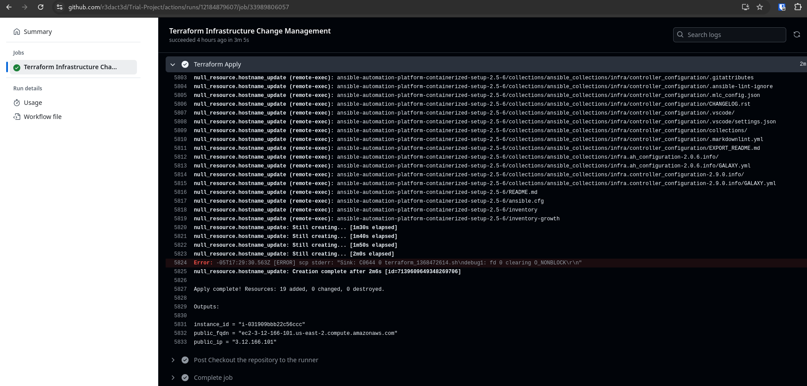

# Open WebUI with Ollama on AWS EC2 via Terraform

## Terraform Infrastructure

### Overview

This project leverages Terraform to provision infrastructure and integrates GitHub Actions for streamlined automation. Key features include:

- A publicly accessible EC2 instance running on AWS.
- AWS infrastructure and instance configuration automated with Terraform.
- GitHub Actions workflows for:
  - Automatically creating a Terraform plan on a pull request.
  - Applying infrastructure changes upon pull request merge.

> **Note:** Familiarize yourself with all resources in the `terraform` directory, particularly `main.tf`.

---

### Architecture Diagram


> **Note:**
> - Please see `terraform` code in `main.tf`.

---

### Implementation

> Summary of steps:
1. Clone this repo
2. Create/update GitHub Secrets
3. Create Terraform backend S3 bucket in AWS
4. Create a new GitHub Branch & update SSH key in `user_data.txt`
5. Double check resources in `main.tf`
6. Create a PullRequest to Main and merge

#### Procedure

1. **Gather Requirements**
   - Clone the GitHub repository.

2. **Configure Repository Secrets**
   Add the following secrets in the GitHub repository settings:

   - `AWS_ACCESS_KEY`
   - `AWS_SECRET_ACCESS_KEY`
   - `SOURCE_IP` - this is the source IP used to login to Open WebUI for the first time

   > **Note:**
   > - Below 2 secrets are only needed for RHEL servers that need to be registered
   - `ORG_ID` (Profile in [cloud.redhat.com](https://cloud.redhat.com))
   - `ACTIVATION_KEY` (Created in **Inventory > System Configuration > Activation Keys** [console.redhat.com](https://console.redhat.com/insights/connector/activation-keys#SIDs=&tags=))

   

1. **Validate Terraform Manifests**
   Review and update files in the `terraform` directory as necessary:
   - `main.tf`
   - `output.tf`
   - `user_data.txt`

   > **Note:**
   - Ensure your SSH public key is added to `user_data.txt`. This is the public key from your laptop or bastion server so you can SSH in for maintenance and run the installer.
   - Create an S3 bucket referenced in the backend configuration of `main.tf` (e.g., `tfstate-bucket-auto-intelligence`). If you use a different name, look and update the code.
   - Review `user-data.txt` for specifics to configure the EC2 instance.
   - Validate AMI ID and instance type (this is currently configured for GPU and Nvidia acceleration).
   

#### Pull Request Validation

4. **Automated Validation with GitHub Actions**
   GitHub Actions will validate pull requests with the following Terraform steps before allowing a merge:
   - `terraform fmt`
   - `terraform init`
   - `terraform validate`
   - `terraform plan`

   > **Note:**
   > - DO NOT MERGE until you are happy with the Terraform plan. If you update anything in the `terraform` directory, the GitHub Actions Workflow will kick off.

---

### Post-Infrastructure: Installing Ollama and Open WebUI

5. **Review Terraform Outputs**
   After the GitHub Actions workflow completes, retrieve instance details from the output.
   - Use the public IP to SSH into the instance (`ec2-user`).

   Validate:
   - Expected results from `user_data.txt`.
   - Expected results from the provisioner in `main.tf`.

   

6. **Install**
   From the machine with the corresponding SSH keys that were added to the `user_data.txt`:

   ```bash
   ssh ec2-user@<public IP>
   ```

   To install the Open WebUI Docker container that is bundled with Ollama:

   ```bash
   docker run -d -p 3000:8080 --gpus=all -v ollama:/root/.ollama -v open-webui:/app/backend/data --name open-webui --restart always ghcr.io/open-webui/open-webui:ollama
   ```

   At this point, we should be able to access the Open WebUI through our browser at *https://public IP/:3000* so we can login first as Admin and do the initial config.

   **NOTE:** You might still need to open port 3000 for your IP address if you didn't code it in Terraform.

   > To get a model to work with, search [Ollama](https://ollama.com/search) for any model you want, then search in the [Open WebUI](https://docs.openwebui.com/getting-started/quick-start/starting-with-ollama) GUI to pull it.

   

Now, we can start chatting, engineering prompts, or start fine-tuning.

## Validation - Benchmarking

> Running the below command confirms the needed packages are installed and the output reflects the GPU being used, confirming the drivers are configured correctly.
```bash
nvidia-smi -l
```


## Backup and Restore - to be tested

```bash
docker cp open-webui:/app/backend/data/webui.db ./webui.db
aws s3 cp webui.db s3://tfstate-bucket-auto-intelligence/webui.db
```

## TODO

- Attempt backup and restore
- Automate backup
- Automate Docker run and restore